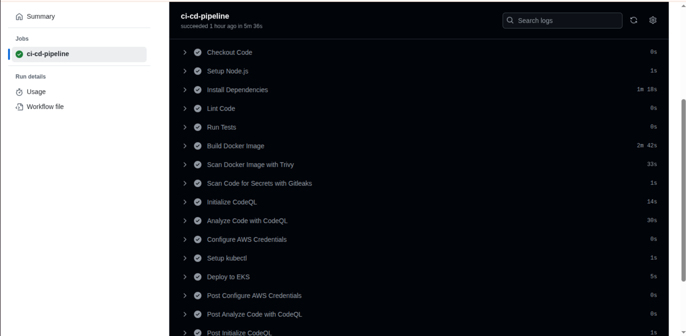
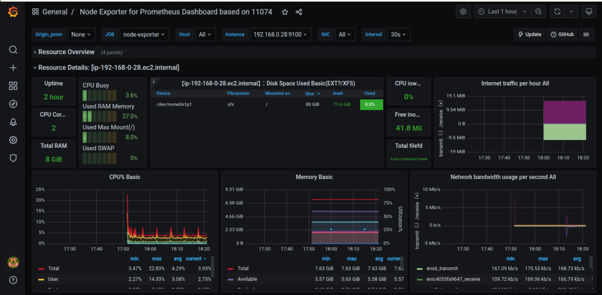
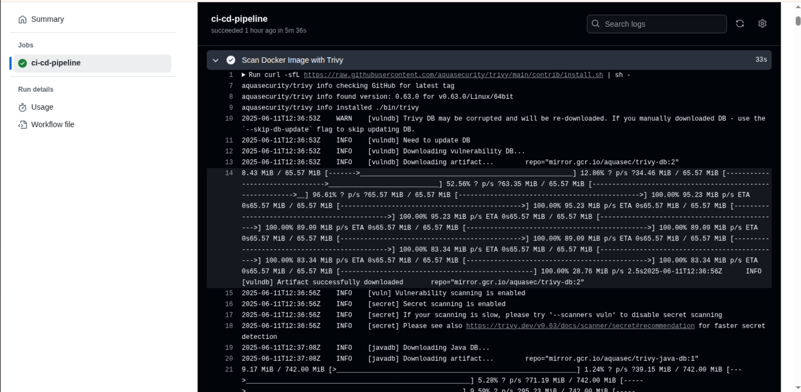

[](https://travis-ci.org/microservices-demo/microservices-demo)

# Project 2: CI/CD & DevSecOps Pipeline with Kubernetes and AWS EKS

This project demonstrates a complete **CI/CD and DevSecOps pipeline** for a microservices-based e-commerce application using **GitHub Actions**, **Docker**, **Kubernetes (EKS)**, **Helm**, **Trivy**, **Gitleaks**, **Prometheus**, and **Grafana**.

---

## 🚀 Tech Stack

* **Infrastructure**: AWS EKS, EC2, IAM, kubectl
* **CI/CD**: GitHub Actions
* **Security**: Trivy (Vulnerability Scanner), Gitleaks (Secrets Scanner)
* **Monitoring**: Prometheus, Grafana
* **Microservices**: Sock Shop Demo (13+ services)

---

## 🔄 CI/CD Pipeline Stages

1. **Checkout Code**
2. **Set up Node.js (for microservices)**
3. **Install Dependencies**
4. **Lint Code**
5. **Run Unit Tests**
6. **Build Docker Images**
7. **Scan Docker Images with Trivy**
8. **Scan Code for Secrets with Gitleaks**
9. **Analyze Code with CodeQL**
10. **Configure AWS Credentials (OIDC)**
11. **Set up kubectl and connect to EKS**
12. **Deploy microservices to EKS using manifests**

---

## 🚫 Security Integration

* **Trivy**: Scans Docker images for vulnerabilities in base images, OS packages, and app dependencies
* **Gitleaks**: Checks for hardcoded secrets (API keys, tokens, passwords)
* **CodeQL**: Static code analysis (JavaScript)

---

## 🎓 Kubernetes Deployment

```bash
kubectl get pods -n sock-shop
kubectl get svc -n sock-shop
```

All 13 services (carts, catalogue, front-end, payment, shipping, etc.) are deployed and running inside the EKS cluster under namespace `sock-shop`.

---

## 🌐 Monitoring Stack

Namespace: `monitoring`

* **Prometheus**: Collects metrics from `node-exporter`, `kube-state-metrics`, etc.
* **Grafana**: Visualizes resource usage, service health, network, CPU, memory, etc.

Access Grafana via:

```
http://<EC2_PUBLIC_IP>:31300
```

---

## 👀 Dashboards (Sample Screenshots)

1. **CI/CD GitHub Actions Pipeline Success Log**
2. **All Microservices Running (kubectl get svc -n sock-shop)**
3. **Grafana Welcome Dashboard**
4. **Node Exporter Metrics**
5. **Prometheus Targets Active**

> Screenshots are saved in the `screenshots/` directory.

---

## 📅 Project Status

* [x] EKS Cluster and Node Group Created
* [x] Microservices Deployed
* [x] CI/CD GitHub Actions Integrated
* [x] Vulnerability & Secrets Scans Implemented
* [x] Monitoring Tools Set Up

---

## ✅ Cleanup Instructions

To delete the cluster:

```bash
aws eks delete-cluster --name devsecops-cluster --region us-east-1
```

Make sure all node groups are deleted first via the AWS Console or CLI.

---

## 📚 How to Use This Project

1. Fork this repository
2. Configure OIDC/IAM for GitHub Actions
3. Update `.github/workflows/ci-cd.yml`
4. Commit changes to trigger the pipeline

---

## 🎉 Author

**Ahmed (DevOps Engineer)**
GitHub: [@Ahmedtech2003](https://github.com/Ahmedtech2003)

---

## 🛌 License

This project is licensed under the MIT License.

---

## 📷 Application Screenshots

### 1. CI/CD GitHub Actions Pipeline Success Log


### 2. Grafana Welcome Dashboard


### 3. Trivy Vulnerability Scan Output


### 4. Sock Shop Frontend


### 5. Sock Shop in Weave Scope


---


